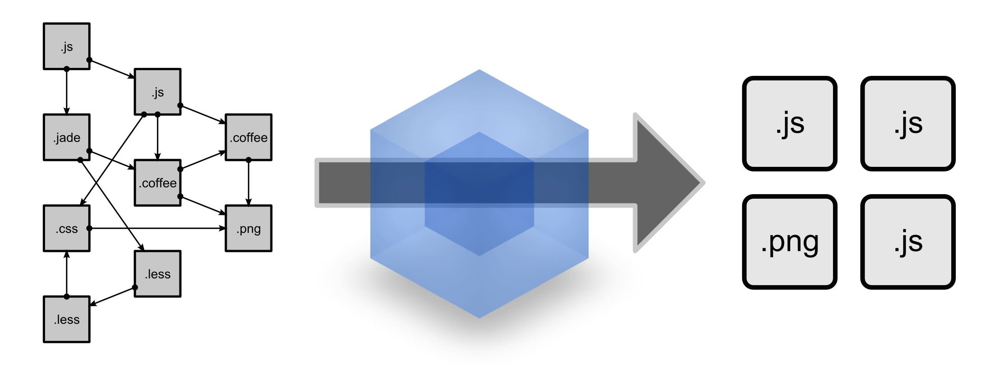

# Pourquoi Webpack ?

Webpack a pour objectif de vous faciliter la vie, notamment en vous aidant à
organiser [votre application JS en modules](/posts/js/etat-lieux-js-modulaire-front/).
Le projet est déjà très populaire, particulièrement dans la communauté React, ce qui
parait logique vu qu'il s'agit de développer des composants.

Webpack apporte à ce niveau des fonctionnalités intéressantes :

- disposer de toutes les ressources statiques (CSS, images, fontes) en tant que
  module,
- intégrer et consommer des bibliothèques tierces très simplement en tant
  que module,
- séparer votre `build` en plusieurs morceaux, chargés à la demande,
- garder un chargement initial très rapide si besoin,
- personnaliser la plupart des étapes du processus,
- adapté pour les gros projets.

Avant Webpack, nous avions beau avoir des super task-runners comme
[Grunt](/posts/js/premiers-pas-avec-grunt)
ou
[Gulp](/posts/js/introduction-gulp),
il faut avouer qu'on bricolait quand même pas mal.

Et vous avez sûrement mieux à faire que de devoir modifier des configurations ou
des définitions de tâches pour ajuster les copies d'images ou de fontes, ou
encore ajuster des URL générées.
Il y avait avec ces solutions une grande partie de rafistolage, où l’on se
devait de faire très attention à la moindre réorganisation de code, sous peine
de casser une partie du rendu.

Prenons par exemple une image de fond déclarée en CSS via un
`background: url(...)`.
Qui vous préviendra lorsque celle-ci aura été supprimée ou déplacée,
et que la référence n'est donc plus bonne ?
Peut-être vos logs de serveur web ? En recherchant les erreurs HTTP 404...

Vous avez la responsabilité de gérer vos tâches et leurs résultats tout en vous
assurant du bon fonctionnement car vous êtes la glu entre tous ces morceaux.

# Qu'est-ce que Webpack ?

Pas besoin de s'appeler Einstein pour comprendre les intentions de Webpack en
interprétant le nom : web + pack. Faire un pack prêt pour le web.

Nativement, Webpack s'occupe uniquement de ressources JavaScript.
Webpack propose un système de *loader* qui permet de transformer tout et
n'importe quoi en JavaScript (mais pas que).
Ainsi, tout est consommable en tant que module.

Webpack prend à charge la fonction `require()` (connue et utilisée dans node.js et
browserify) et permet de définir des nouveaux comportements.

```js
var myModule = require("./my-module.js")
// "classique" pour ceux qui utilisent node.js/browserify

// nouveauté avec Webpack
var myStyles = require("./my-module.css")
// si vous utilisez le css-loader par exemple, toutes les directives url()
// se comporteront comme des require(), ainsi, vous pourrez appliquer
// des loaders sur tous vos assets et vous aurez des erreurs à la compilation
// si une ressource est manquante.

// vous pourrez aussi consommer des SVG en tant que chaînes (eg: raw-loader)
var mySVG = require("./my-module.svg")

// ou inclure des fichiers dans votre build (via file-loader)
require("index.html")
```

C'est cette partie qui est aujourd'hui la plus intéressante et la plus flexible.

<figure>
  
  <figcaption>
    Webpack transforme une multitude de fichiers en lots par responsabilité
  </figcaption>
</figure>

Webpack va donc pouvoir s'occuper aussi bien de vos modules JavaScript
(CommonJS, AMD, UMD...),
mais aussi de [vos modules CSS](https://github.com/css-modules/css-modules),
de vos fichiers SVG, gif, png, etc. ainsi que potentiellement n'importe quel
type de fichier pour peu que vous preniez le temps d'écrire un *loader*
(rassurez-vous, il existe déjà un loader pour tous les fichiers que vous
manipulez couramment).

En plus de cela, il a été pensé afin de permettre la séparation de votre pack
(votre gros fichier JavaScript compilé) en plusieurs morceaux, selon vos
besoins : vous pourrez ainsi ajuster la balance entre performance et lazy
loading.

Avec les solutions existantes, il est actuellement très difficile d'arriver
facilement à ce que propose Webpack, pour ne pas dire impossible.

Il est possible d'avoir l'équivalent avec
[browserify](/posts/js/browserify-all-the-things) comme l'a indiqué son auteur
dans un article
[browserify for Webpack users](https://gist.github.com/substack/68f8d502be42d5cd4942)
(qui est une réponse à la ressource
[Webpack for browserify users](https://github.com/webpack/docs/wiki/webpack-for-browserify-users)
).

Il est clair que cela n'est pas aussi simple qu'avec Webpack qui est beaucoup
plus flexible de par sa conception et ses objectifs initiaux.

Par exemple, browserify pourra appliquer d'éventuelles transformations
uniquement au code local et donc pas dans `node_modules/*`.
Cela peut être problématique et nous conduit forcément à finir par du
bricolage si on veut consommer des assets de modules de manière transparente.

Ne parlons pas du
[hot loading](http://webpack.github.io/docs/hot-module-replacement-with-webpack.html)
(remplacement de code à la volée)
qui n'est pas du tout facile à mettre en place (pour le moment) avec
autre chose que Webpack.

# Comment intégrer Webpack dans votre workflow ?

Dans un premier temps vous pourrez facilement intégrer Webpack en remplacement de
[browserify](/posts/js/browserify-all-the-things/) ou d'une éventuelle
concaténation via des plugins Gulp, Grunt, etc.

Dans un second temps, vous pourrez très certainement remplacer une partie de vos
autres tâches pour ajuster/copier/déplacer vos assets (CSS, images...) et
ainsi réduire le code dédié à votre workflow. Il se pourrait alors que votre
utilisation d'un task-runner soit maintenant si réduite que vous pourriez vous
en passez en utilisant simplement
[des scripts npm](http://blog.keithcirkel.co.uk/how-to-use-npm-as-a-build-tool/).

Si jamais vous êtes limité, [vous pourrez bien entendu créer votre propre
 commande](/posts/shell/utilitaires-ligne-commande/), qui sera réutilisable dans
n'importe quel contexte.

# Webpack en pratique

Quelques ressources pour vous y mettre :

- Un premier [exemple détaillé de configuration et d'utilisation](/posts/webpack/premier-exemple)
basé sur notre retour d'expérience.

En anglais :

- [Tutoriel officiel](http://webpack.github.io/docs/tutorials/getting-started/)
- [Slides d'introduction](http://okonet.ru/viennajs-webpack-introduction/)
- ["How to" webpack](https://github.com/petehunt/webpack-howto)

[Webpack possède une documentation](http://webpack.github.io/docs)
assez fournie, mais pas vraiment facile à aborder lorsqu'on découvre le projet.
Aussi, n'hésitez pas à nous poser vos questions en commentaires.
